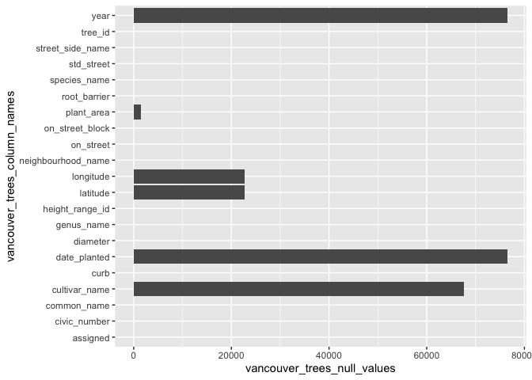
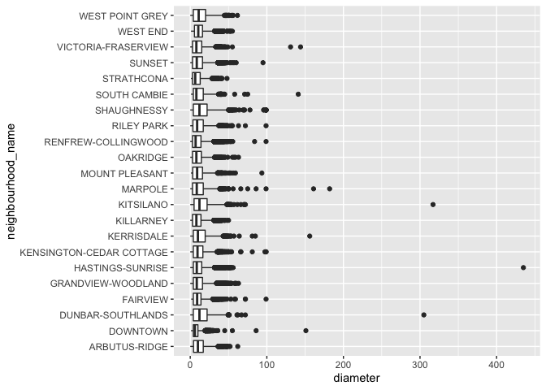
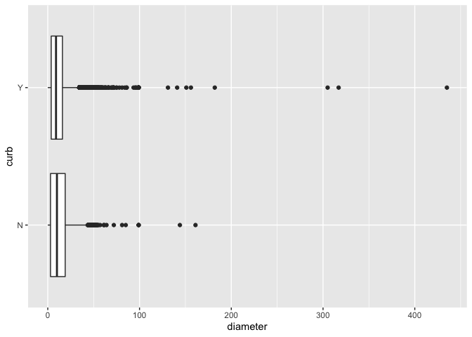
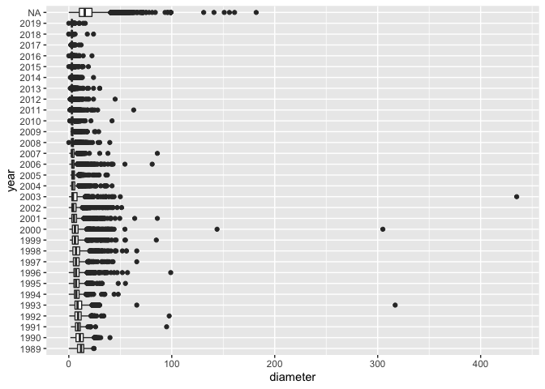
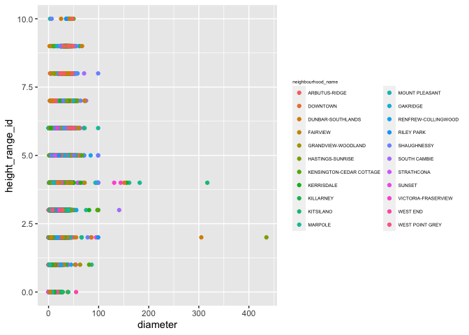
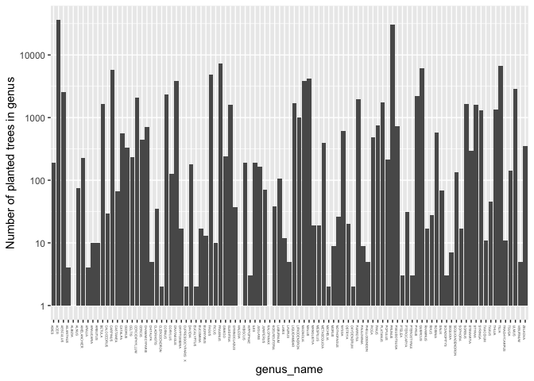
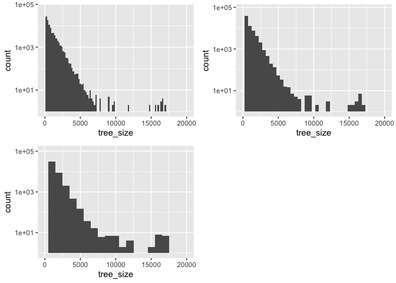
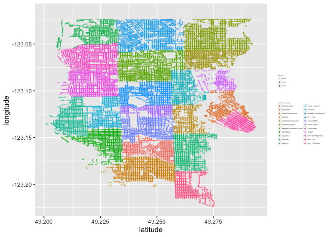
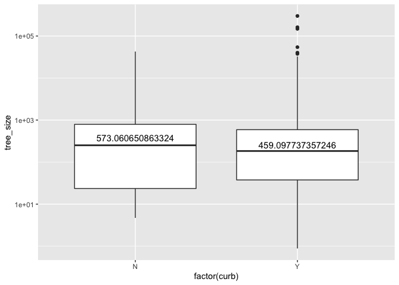

Mini Data-Analysis Deliverable 1
================

true

# Welcome to your (maybe) first-ever data analysis project!

And hopefully the first of many. Let’s get started:

1.  Install the [`datateachr`](https://github.com/UBC-MDS/datateachr)
    package by typing the following into your **R terminal**:

<!-- -->

    install.packages("devtools")
    devtools::install_github("UBC-MDS/datateachr")

2.  Load the packages below.

``` r
library(datateachr)
library(tidyverse)
```

    ## ── Attaching packages ─────────────────────────────────────── tidyverse 1.3.2 ──
    ## ✔ ggplot2 3.3.6      ✔ purrr   0.3.4 
    ## ✔ tibble  3.1.8      ✔ dplyr   1.0.10
    ## ✔ tidyr   1.2.1      ✔ stringr 1.4.1 
    ## ✔ readr   2.1.2      ✔ forcats 0.5.2 
    ## ── Conflicts ────────────────────────────────────────── tidyverse_conflicts() ──
    ## ✖ dplyr::filter() masks stats::filter()
    ## ✖ dplyr::lag()    masks stats::lag()

3.  Make a repository in the <https://github.com/stat545ubc-2022>
    Organization. You will be working with this repository for the
    entire data analysis project. You can either make it public, or make
    it private and add the TA’s and Lucy as collaborators.

# Instructions

## For Both Milestones

-   Each milestone is worth 45 points. The number of points allocated to
    each task will be annotated within each deliverable. Tasks that are
    more challenging will often be allocated more points.

-   10 points will be allocated to the reproducibility, cleanliness, and
    coherence of the overall analysis. While the two milestones will be
    submitted as independent deliverables, the analysis itself is a
    continuum - think of it as two chapters to a story. Each chapter, or
    in this case, portion of your analysis, should be easily followed
    through by someone unfamiliar with the content.
    [Here](https://swcarpentry.github.io/r-novice-inflammation/06-best-practices-R/)
    is a good resource for what constitutes “good code”. Learning good
    coding practices early in your career will save you hassle later on!

## For Milestone 1

**To complete this milestone**, edit [this very `.Rmd`
file](https://raw.githubusercontent.com/UBC-STAT/stat545.stat.ubc.ca/master/content/mini-project/mini-project-1.Rmd)
directly. Fill in the sections that are tagged with
`<!--- start your work below --->`.

**To submit this milestone**, make sure to knit this `.Rmd` file to an
`.md` file by changing the YAML output settings from
`output: html_document` to `output: github_document`. Commit and push
all of your work to the mini-analysis GitHub repository you made
earlier, and tag a release on GitHub. Then, submit a link to your tagged
release on canvas.

**Points**: This milestone is worth 45 points: 43 for your analysis, 1
point for having your Milestone 1 document knit error-free, and 1 point
for tagging your release on Github.

# Learning Objectives

By the end of this milestone, you should:

-   Become familiar with your dataset of choosing
-   Select 4 questions that you would like to answer with your data
-   Generate a reproducible and clear report using R Markdown
-   Become familiar with manipulating and summarizing your data in
    tibbles using `dplyr`, with a research question in mind.

# Task 1: Choose your favorite dataset (10 points)

The `datateachr` package by Hayley Boyce and Jordan Bourak currently
composed of 7 semi-tidy datasets for educational purposes. Here is a
brief description of each dataset:

-   *apt_buildings*: Acquired courtesy of The City of Toronto’s Open
    Data Portal. It currently has 3455 rows and 37 columns.

-   *building_permits*: Acquired courtesy of The City of Vancouver’s
    Open Data Portal. It currently has 20680 rows and 14 columns.

-   *cancer_sample*: Acquired courtesy of UCI Machine Learning
    Repository. It currently has 569 rows and 32 columns.

-   *flow_sample*: Acquired courtesy of The Government of Canada’s
    Historical Hydrometric Database. It currently has 218 rows and 7
    columns.

-   *parking_meters*: Acquired courtesy of The City of Vancouver’s Open
    Data Portal. It currently has 10032 rows and 22 columns.

-   *steam_games*: Acquired courtesy of Kaggle. It currently has 40833
    rows and 21 columns.

-   *vancouver_trees*: Acquired courtesy of The City of Vancouver’s Open
    Data Portal. It currently has 146611 rows and 20 columns.

**Things to keep in mind**

-   We hope that this project will serve as practice for carrying our
    your own *independent* data analysis. Remember to comment your code,
    be explicit about what you are doing, and write notes in this
    markdown document when you feel that context is required. As you
    advance in the project, prompts and hints to do this will be
    diminished - it’ll be up to you!

-   Before choosing a dataset, you should always keep in mind **your
    goal**, or in other ways, *what you wish to achieve with this data*.
    This mini data-analysis project focuses on *data wrangling*,
    *tidying*, and *visualization*. In short, it’s a way for you to get
    your feet wet with exploring data on your own.

And that is exactly the first thing that you will do!

1.1 Out of the 7 datasets available in the `datateachr` package, choose
**4** that appeal to you based on their description. Write your choices
below:

**Note**: We encourage you to use the ones in the `datateachr` package,
but if you have a dataset that you’d really like to use, you can include
it here. But, please check with a member of the teaching team to see
whether the dataset is of appropriate complexity. Also, include a
**brief** description of the dataset here to help the teaching team
understand your data.

<!-------------------------- Start your work below ---------------------------->

## Choosing 4 Datasets

1: cancer_sample

2: vancouver_trees

3: steam_games

4: apt_buildings

<!----------------------------------------------------------------------------->

1.2 One way to narrowing down your selection is to *explore* the
datasets. Use your knowledge of dplyr to find out at least *3*
attributes about each of these datasets (an attribute is something such
as number of rows, variables, class type…). The goal here is to have an
idea of *what the data looks like*.

*Hint:* This is one of those times when you should think about the
cleanliness of your analysis. I added a single code chunk for you below,
but do you want to use more than one? Would you like to write more
comments outside of the code chunk?

<!-------------------------- Start your work below ---------------------------->

## Exploration of 4 datasets

**In the following code blocks I will explore the cancer_sample,
vancouver_trees, steam_games and apt_buildings datasets. I will use the
head(), class() and glimpse() functions to obtain preliminary
information on these datasets.**

1.  The following codeblock contains the preliminary exploration of the
    cancer_sample dataset:

``` r
# view first 6 rows of dataset with head function
head(cancer_sample)
```

    ## # A tibble: 6 × 32
    ##       ID diagn…¹ radiu…² textu…³ perim…⁴ area_…⁵ smoot…⁶ compa…⁷ conca…⁸ conca…⁹
    ##    <dbl> <chr>     <dbl>   <dbl>   <dbl>   <dbl>   <dbl>   <dbl>   <dbl>   <dbl>
    ## 1 8.42e5 M          18.0    10.4   123.    1001   0.118   0.278   0.300   0.147 
    ## 2 8.43e5 M          20.6    17.8   133.    1326   0.0847  0.0786  0.0869  0.0702
    ## 3 8.43e7 M          19.7    21.2   130     1203   0.110   0.160   0.197   0.128 
    ## 4 8.43e7 M          11.4    20.4    77.6    386.  0.142   0.284   0.241   0.105 
    ## 5 8.44e7 M          20.3    14.3   135.    1297   0.100   0.133   0.198   0.104 
    ## 6 8.44e5 M          12.4    15.7    82.6    477.  0.128   0.17    0.158   0.0809
    ## # … with 22 more variables: symmetry_mean <dbl>, fractal_dimension_mean <dbl>,
    ## #   radius_se <dbl>, texture_se <dbl>, perimeter_se <dbl>, area_se <dbl>,
    ## #   smoothness_se <dbl>, compactness_se <dbl>, concavity_se <dbl>,
    ## #   concave_points_se <dbl>, symmetry_se <dbl>, fractal_dimension_se <dbl>,
    ## #   radius_worst <dbl>, texture_worst <dbl>, perimeter_worst <dbl>,
    ## #   area_worst <dbl>, smoothness_worst <dbl>, compactness_worst <dbl>,
    ## #   concavity_worst <dbl>, concave_points_worst <dbl>, symmetry_worst <dbl>, …

``` r
# view class type of dataset
class(cancer_sample)
```

    ## [1] "spec_tbl_df" "tbl_df"      "tbl"         "data.frame"

``` r
# view an overview of rows and columns, and see all variables and first few data entries 
glimpse(cancer_sample)
```

    ## Rows: 569
    ## Columns: 32
    ## $ ID                      <dbl> 842302, 842517, 84300903, 84348301, 84358402, …
    ## $ diagnosis               <chr> "M", "M", "M", "M", "M", "M", "M", "M", "M", "…
    ## $ radius_mean             <dbl> 17.990, 20.570, 19.690, 11.420, 20.290, 12.450…
    ## $ texture_mean            <dbl> 10.38, 17.77, 21.25, 20.38, 14.34, 15.70, 19.9…
    ## $ perimeter_mean          <dbl> 122.80, 132.90, 130.00, 77.58, 135.10, 82.57, …
    ## $ area_mean               <dbl> 1001.0, 1326.0, 1203.0, 386.1, 1297.0, 477.1, …
    ## $ smoothness_mean         <dbl> 0.11840, 0.08474, 0.10960, 0.14250, 0.10030, 0…
    ## $ compactness_mean        <dbl> 0.27760, 0.07864, 0.15990, 0.28390, 0.13280, 0…
    ## $ concavity_mean          <dbl> 0.30010, 0.08690, 0.19740, 0.24140, 0.19800, 0…
    ## $ concave_points_mean     <dbl> 0.14710, 0.07017, 0.12790, 0.10520, 0.10430, 0…
    ## $ symmetry_mean           <dbl> 0.2419, 0.1812, 0.2069, 0.2597, 0.1809, 0.2087…
    ## $ fractal_dimension_mean  <dbl> 0.07871, 0.05667, 0.05999, 0.09744, 0.05883, 0…
    ## $ radius_se               <dbl> 1.0950, 0.5435, 0.7456, 0.4956, 0.7572, 0.3345…
    ## $ texture_se              <dbl> 0.9053, 0.7339, 0.7869, 1.1560, 0.7813, 0.8902…
    ## $ perimeter_se            <dbl> 8.589, 3.398, 4.585, 3.445, 5.438, 2.217, 3.18…
    ## $ area_se                 <dbl> 153.40, 74.08, 94.03, 27.23, 94.44, 27.19, 53.…
    ## $ smoothness_se           <dbl> 0.006399, 0.005225, 0.006150, 0.009110, 0.0114…
    ## $ compactness_se          <dbl> 0.049040, 0.013080, 0.040060, 0.074580, 0.0246…
    ## $ concavity_se            <dbl> 0.05373, 0.01860, 0.03832, 0.05661, 0.05688, 0…
    ## $ concave_points_se       <dbl> 0.015870, 0.013400, 0.020580, 0.018670, 0.0188…
    ## $ symmetry_se             <dbl> 0.03003, 0.01389, 0.02250, 0.05963, 0.01756, 0…
    ## $ fractal_dimension_se    <dbl> 0.006193, 0.003532, 0.004571, 0.009208, 0.0051…
    ## $ radius_worst            <dbl> 25.38, 24.99, 23.57, 14.91, 22.54, 15.47, 22.8…
    ## $ texture_worst           <dbl> 17.33, 23.41, 25.53, 26.50, 16.67, 23.75, 27.6…
    ## $ perimeter_worst         <dbl> 184.60, 158.80, 152.50, 98.87, 152.20, 103.40,…
    ## $ area_worst              <dbl> 2019.0, 1956.0, 1709.0, 567.7, 1575.0, 741.6, …
    ## $ smoothness_worst        <dbl> 0.1622, 0.1238, 0.1444, 0.2098, 0.1374, 0.1791…
    ## $ compactness_worst       <dbl> 0.6656, 0.1866, 0.4245, 0.8663, 0.2050, 0.5249…
    ## $ concavity_worst         <dbl> 0.71190, 0.24160, 0.45040, 0.68690, 0.40000, 0…
    ## $ concave_points_worst    <dbl> 0.26540, 0.18600, 0.24300, 0.25750, 0.16250, 0…
    ## $ symmetry_worst          <dbl> 0.4601, 0.2750, 0.3613, 0.6638, 0.2364, 0.3985…
    ## $ fractal_dimension_worst <dbl> 0.11890, 0.08902, 0.08758, 0.17300, 0.07678, 0…

2.  The following codeblock contains the preliminary exploration of the
    vancouver_trees dataset:

``` r
head(vancouver_trees)
```

    ## # A tibble: 6 × 20
    ##   tree_id civic_number std_str…¹ genus…² speci…³ culti…⁴ commo…⁵ assig…⁶ root_…⁷
    ##     <dbl>        <dbl> <chr>     <chr>   <chr>   <chr>   <chr>   <chr>   <chr>  
    ## 1  149556          494 W 58TH AV ULMUS   AMERIC… BRANDON BRANDO… N       N      
    ## 2  149563          450 W 58TH AV ZELKOVA SERRATA <NA>    JAPANE… N       N      
    ## 3  149579         4994 WINDSOR … STYRAX  JAPONI… <NA>    JAPANE… N       N      
    ## 4  149590          858 E 39TH AV FRAXIN… AMERIC… AUTUMN… AUTUMN… Y       N      
    ## 5  149604         5032 WINDSOR … ACER    CAMPES… <NA>    HEDGE … N       N      
    ## 6  149616          585 W 61ST AV PYRUS   CALLER… CHANTI… CHANTI… N       N      
    ## # … with 11 more variables: plant_area <chr>, on_street_block <dbl>,
    ## #   on_street <chr>, neighbourhood_name <chr>, street_side_name <chr>,
    ## #   height_range_id <dbl>, diameter <dbl>, curb <chr>, date_planted <date>,
    ## #   longitude <dbl>, latitude <dbl>, and abbreviated variable names
    ## #   ¹​std_street, ²​genus_name, ³​species_name, ⁴​cultivar_name, ⁵​common_name,
    ## #   ⁶​assigned, ⁷​root_barrier

``` r
class(vancouver_trees)
```

    ## [1] "tbl_df"     "tbl"        "data.frame"

``` r
glimpse(vancouver_trees)
```

    ## Rows: 146,611
    ## Columns: 20
    ## $ tree_id            <dbl> 149556, 149563, 149579, 149590, 149604, 149616, 149…
    ## $ civic_number       <dbl> 494, 450, 4994, 858, 5032, 585, 4909, 4925, 4969, 7…
    ## $ std_street         <chr> "W 58TH AV", "W 58TH AV", "WINDSOR ST", "E 39TH AV"…
    ## $ genus_name         <chr> "ULMUS", "ZELKOVA", "STYRAX", "FRAXINUS", "ACER", "…
    ## $ species_name       <chr> "AMERICANA", "SERRATA", "JAPONICA", "AMERICANA", "C…
    ## $ cultivar_name      <chr> "BRANDON", NA, NA, "AUTUMN APPLAUSE", NA, "CHANTICL…
    ## $ common_name        <chr> "BRANDON ELM", "JAPANESE ZELKOVA", "JAPANESE SNOWBE…
    ## $ assigned           <chr> "N", "N", "N", "Y", "N", "N", "N", "N", "N", "N", "…
    ## $ root_barrier       <chr> "N", "N", "N", "N", "N", "N", "N", "N", "N", "N", "…
    ## $ plant_area         <chr> "N", "N", "4", "4", "4", "B", "6", "6", "3", "3", "…
    ## $ on_street_block    <dbl> 400, 400, 4900, 800, 5000, 500, 4900, 4900, 4900, 7…
    ## $ on_street          <chr> "W 58TH AV", "W 58TH AV", "WINDSOR ST", "E 39TH AV"…
    ## $ neighbourhood_name <chr> "MARPOLE", "MARPOLE", "KENSINGTON-CEDAR COTTAGE", "…
    ## $ street_side_name   <chr> "EVEN", "EVEN", "EVEN", "EVEN", "EVEN", "ODD", "ODD…
    ## $ height_range_id    <dbl> 2, 4, 3, 4, 2, 2, 3, 3, 2, 2, 2, 5, 3, 2, 2, 2, 2, …
    ## $ diameter           <dbl> 10.00, 10.00, 4.00, 18.00, 9.00, 5.00, 15.00, 14.00…
    ## $ curb               <chr> "N", "N", "Y", "Y", "Y", "Y", "Y", "Y", "Y", "Y", "…
    ## $ date_planted       <date> 1999-01-13, 1996-05-31, 1993-11-22, 1996-04-29, 19…
    ## $ longitude          <dbl> -123.1161, -123.1147, -123.0846, -123.0870, -123.08…
    ## $ latitude           <dbl> 49.21776, 49.21776, 49.23938, 49.23469, 49.23894, 4…

3.  The following codeblock contains the preliminary exploration of the
    steam_games dataset:

``` r
head(steam_games)
```

    ## # A tibble: 6 × 21
    ##      id url          types name  desc_…¹ recen…² all_r…³ relea…⁴ devel…⁵ publi…⁶
    ##   <dbl> <chr>        <chr> <chr> <chr>   <chr>   <chr>   <chr>   <chr>   <chr>  
    ## 1     1 https://sto… app   DOOM  Now in… Very P… Very P… May 12… id Sof… Bethes…
    ## 2     2 https://sto… app   PLAY… PLAYER… Mixed,… Mixed,… Dec 21… PUBG C… PUBG C…
    ## 3     3 https://sto… app   BATT… Take c… Mixed,… Mostly… Apr 24… Harebr… Parado…
    ## 4     4 https://sto… app   DayZ  The po… Mixed,… Mixed,… Dec 13… Bohemi… Bohemi…
    ## 5     5 https://sto… app   EVE … EVE On… Mixed,… Mostly… May 6,… CCP     CCP,CCP
    ## 6     6 https://sto… bund… Gran… Grand … NaN     NaN     NaN     Rockst… Rockst…
    ## # … with 11 more variables: popular_tags <chr>, game_details <chr>,
    ## #   languages <chr>, achievements <dbl>, genre <chr>, game_description <chr>,
    ## #   mature_content <chr>, minimum_requirements <chr>,
    ## #   recommended_requirements <chr>, original_price <dbl>, discount_price <dbl>,
    ## #   and abbreviated variable names ¹​desc_snippet, ²​recent_reviews,
    ## #   ³​all_reviews, ⁴​release_date, ⁵​developer, ⁶​publisher

``` r
class(steam_games)
```

    ## [1] "spec_tbl_df" "tbl_df"      "tbl"         "data.frame"

``` r
glimpse(steam_games)
```

    ## Rows: 40,833
    ## Columns: 21
    ## $ id                       <dbl> 1, 2, 3, 4, 5, 6, 7, 8, 9, 10, 11, 12, 13, 14…
    ## $ url                      <chr> "https://store.steampowered.com/app/379720/DO…
    ## $ types                    <chr> "app", "app", "app", "app", "app", "bundle", …
    ## $ name                     <chr> "DOOM", "PLAYERUNKNOWN'S BATTLEGROUNDS", "BAT…
    ## $ desc_snippet             <chr> "Now includes all three premium DLC packs (Un…
    ## $ recent_reviews           <chr> "Very Positive,(554),- 89% of the 554 user re…
    ## $ all_reviews              <chr> "Very Positive,(42,550),- 92% of the 42,550 u…
    ## $ release_date             <chr> "May 12, 2016", "Dec 21, 2017", "Apr 24, 2018…
    ## $ developer                <chr> "id Software", "PUBG Corporation", "Harebrain…
    ## $ publisher                <chr> "Bethesda Softworks,Bethesda Softworks", "PUB…
    ## $ popular_tags             <chr> "FPS,Gore,Action,Demons,Shooter,First-Person,…
    ## $ game_details             <chr> "Single-player,Multi-player,Co-op,Steam Achie…
    ## $ languages                <chr> "English,French,Italian,German,Spanish - Spai…
    ## $ achievements             <dbl> 54, 37, 128, NA, NA, NA, 51, 55, 34, 43, 72, …
    ## $ genre                    <chr> "Action", "Action,Adventure,Massively Multipl…
    ## $ game_description         <chr> "About This Game Developed by id software, th…
    ## $ mature_content           <chr> NA, "Mature Content Description  The develope…
    ## $ minimum_requirements     <chr> "Minimum:,OS:,Windows 7/8.1/10 (64-bit versio…
    ## $ recommended_requirements <chr> "Recommended:,OS:,Windows 7/8.1/10 (64-bit ve…
    ## $ original_price           <dbl> 19.99, 29.99, 39.99, 44.99, 0.00, NA, 59.99, …
    ## $ discount_price           <dbl> 14.99, NA, NA, NA, NA, 35.18, 70.42, 17.58, N…

4.  The following codeblock contains the preliminary exploration of the
    apt_buildings dataset:

``` r
head(apt_buildings)
```

    ## # A tibble: 6 × 37
    ##      id air_co…¹ ameni…² balco…³ barri…⁴ bike_…⁵ exter…⁶ fire_…⁷ garba…⁸ heati…⁹
    ##   <dbl> <chr>    <chr>   <chr>   <chr>   <chr>   <chr>   <chr>   <chr>   <chr>  
    ## 1 10359 NONE     Outdoo… YES     YES     0 indo… NO      YES     YES     HOT WA…
    ## 2 10360 NONE     Outdoo… YES     NO      0 indo… NO      YES     YES     HOT WA…
    ## 3 10361 NONE     <NA>    YES     NO      Not Av… NO      YES     NO      HOT WA…
    ## 4 10362 NONE     <NA>    YES     YES     Not Av… YES     YES     NO      HOT WA…
    ## 5 10363 NONE     <NA>    NO      NO      12 ind… NO      YES     NO      HOT WA…
    ## 6 10364 NONE     <NA>    NO      NO      Not Av… <NA>    YES     NO      HOT WA…
    ## # … with 27 more variables: intercom <chr>, laundry_room <chr>,
    ## #   locker_or_storage_room <chr>, no_of_elevators <dbl>, parking_type <chr>,
    ## #   pets_allowed <chr>, prop_management_company_name <chr>,
    ## #   property_type <chr>, rsn <dbl>, separate_gas_meters <chr>,
    ## #   separate_hydro_meters <chr>, separate_water_meters <chr>,
    ## #   site_address <chr>, sprinkler_system <chr>, visitor_parking <chr>,
    ## #   ward <chr>, window_type <chr>, year_built <dbl>, year_registered <dbl>, …

``` r
class(apt_buildings)
```

    ## [1] "tbl_df"     "tbl"        "data.frame"

``` r
glimpse(apt_buildings)
```

    ## Rows: 3,455
    ## Columns: 37
    ## $ id                               <dbl> 10359, 10360, 10361, 10362, 10363, 10…
    ## $ air_conditioning                 <chr> "NONE", "NONE", "NONE", "NONE", "NONE…
    ## $ amenities                        <chr> "Outdoor rec facilities", "Outdoor po…
    ## $ balconies                        <chr> "YES", "YES", "YES", "YES", "NO", "NO…
    ## $ barrier_free_accessibilty_entr   <chr> "YES", "NO", "NO", "YES", "NO", "NO",…
    ## $ bike_parking                     <chr> "0 indoor parking spots and 10 outdoo…
    ## $ exterior_fire_escape             <chr> "NO", "NO", "NO", "YES", "NO", NA, "N…
    ## $ fire_alarm                       <chr> "YES", "YES", "YES", "YES", "YES", "Y…
    ## $ garbage_chutes                   <chr> "YES", "YES", "NO", "NO", "NO", "NO",…
    ## $ heating_type                     <chr> "HOT WATER", "HOT WATER", "HOT WATER"…
    ## $ intercom                         <chr> "YES", "YES", "YES", "YES", "YES", "Y…
    ## $ laundry_room                     <chr> "YES", "YES", "YES", "YES", "YES", "Y…
    ## $ locker_or_storage_room           <chr> "NO", "YES", "YES", "YES", "NO", "YES…
    ## $ no_of_elevators                  <dbl> 3, 3, 0, 1, 0, 0, 0, 2, 4, 2, 0, 2, 2…
    ## $ parking_type                     <chr> "Underground Garage , Garage accessib…
    ## $ pets_allowed                     <chr> "YES", "YES", "YES", "YES", "YES", "Y…
    ## $ prop_management_company_name     <chr> NA, "SCHICKEDANZ BROS. PROPERTIES", N…
    ## $ property_type                    <chr> "PRIVATE", "PRIVATE", "PRIVATE", "PRI…
    ## $ rsn                              <dbl> 4154812, 4154815, 4155295, 4155309, 4…
    ## $ separate_gas_meters              <chr> "NO", "NO", "NO", "NO", "NO", "NO", "…
    ## $ separate_hydro_meters            <chr> "YES", "YES", "YES", "YES", "YES", "Y…
    ## $ separate_water_meters            <chr> "NO", "NO", "NO", "NO", "NO", "NO", "…
    ## $ site_address                     <chr> "65  FOREST MANOR RD", "70  CLIPPER R…
    ## $ sprinkler_system                 <chr> "YES", "YES", "NO", "YES", "NO", "NO"…
    ## $ visitor_parking                  <chr> "PAID", "FREE", "UNAVAILABLE", "UNAVA…
    ## $ ward                             <chr> "17", "17", "03", "03", "02", "02", "…
    ## $ window_type                      <chr> "DOUBLE PANE", "DOUBLE PANE", "DOUBLE…
    ## $ year_built                       <dbl> 1967, 1970, 1927, 1959, 1943, 1952, 1…
    ## $ year_registered                  <dbl> 2017, 2017, 2017, 2017, 2017, NA, 201…
    ## $ no_of_storeys                    <dbl> 17, 14, 4, 5, 4, 4, 4, 7, 32, 4, 4, 7…
    ## $ emergency_power                  <chr> "NO", "YES", "NO", "NO", "NO", "NO", …
    ## $ `non-smoking_building`           <chr> "YES", "NO", "YES", "YES", "YES", "NO…
    ## $ no_of_units                      <dbl> 218, 206, 34, 42, 25, 34, 14, 105, 57…
    ## $ no_of_accessible_parking_spaces  <dbl> 8, 10, 20, 42, 12, 0, 5, 1, 1, 6, 12,…
    ## $ facilities_available             <chr> "Recycling bins", "Green Bin / Organi…
    ## $ cooling_room                     <chr> "NO", "NO", "NO", "NO", "NO", "NO", "…
    ## $ no_barrier_free_accessible_units <dbl> 2, 0, 0, 42, 0, NA, 14, 0, 0, 1, 25, …

<!----------------------------------------------------------------------------->

1.3 Now that you’ve explored the 4 datasets that you were initially most
interested in, let’s narrow it down to 2. What lead you to choose these
2? Briefly explain your choices below, and feel free to include any code
in your explanation.

<!-------------------------- Start your work below ---------------------------->

## Two interesting datasets:

**vancouver_trees** The first dataset I am interested in working with is
the vancouver_trees dataset. I like plants, and am interested in
analyzing if there is a relationship between neighborhood and size of
tree. Both of these variables are included in the dataset, as confirmed
by use of the glimpse() function. Additionally this dataset is already
in tibble format, making it easier to work with. I ascertained this
information by using the class() function. This sample also has 146,611
rows, so a very large sample size, which makes it better for ensuring an
accurate analysis with interpretable and generalizable results.

**apt_buildings** The second dataset I am interested in working with is
the apt_buildings dataset.I am interested in analyzing if there is a
relationship between the year the apartment is built in and the number
of accessibility features it has. This dataset is also a tibble (found
by using class()), making it easier to work with. Using the glipsme()
function I found that there are several different accessibility
variables included in the dataset to analyze, making the analysis more
robust.

<!----------------------------------------------------------------------------->

1.4 Time for the final decision! Going back to the beginning, it’s
important to have an *end goal* in mind. For example, if I had chosen
the `titanic` dataset for my project, I might’ve wanted to explore the
relationship between survival and other variables. Try to think of 1
research question that you would want to answer with each dataset. Note
them down below, and make your final choice based on what seems more
interesting to you!

<!-------------------------- Start your work below ---------------------------->

## Final dataset descision

**vancouver_trees** I am most interested in working with the
vancouver_trees dataset. I like plants, and am interested to analyze if
there is a relationship between neighborhood and size of trees. Then I
can go walk around and check them out when I’m done this project!

<!----------------------------------------------------------------------------->

# Important note

Read Tasks 2 and 3 *fully* before starting to complete either of them.
Probably also a good point to grab a coffee to get ready for the fun
part!

This project is semi-guided, but meant to be *independent*. For this
reason, you will complete tasks 2 and 3 below (under the **START HERE**
mark) as if you were writing your own exploratory data analysis report,
and this guidance never existed! Feel free to add a brief introduction
section to your project, format the document with markdown syntax as you
deem appropriate, and structure the analysis as you deem appropriate.
Remember, marks will be awarded for completion of the 4 tasks, but 10
points of the whole project are allocated to a reproducible and clean
analysis. If you feel lost, you can find a sample data analysis
[here](https://www.kaggle.com/headsortails/tidy-titarnic) to have a
better idea. However, bear in mind that it is **just an example** and
you will not be required to have that level of complexity in your
project.

# Task 2: Exploring your dataset (15 points)

If we rewind and go back to the learning objectives, you’ll see that by
the end of this deliverable, you should have formulated *4* research
questions about your data that you may want to answer during your
project. However, it may be handy to do some more exploration on your
dataset of choice before creating these questions - by looking at the
data, you may get more ideas. **Before you start this task, read all
instructions carefully until you reach START HERE under Task 3**.

2.1 Complete *4 out of the following 8 exercises* to dive deeper into
your data. All datasets are different and therefore, not all of these
tasks may make sense for your data - which is why you should only answer
*4*. Use *dplyr* and *ggplot*.

1.  Plot the distribution of a numeric variable.
2.  Create a new variable based on other variables in your data (only if
    it makes sense)
3.  Investigate how many missing values there are per variable. Can you
    find a way to plot this?
4.  Explore the relationship between 2 variables in a plot.
5.  Filter observations in your data according to your own criteria.
    Think of what you’d like to explore - again, if this was the
    `titanic` dataset, I may want to narrow my search down to passengers
    born in a particular year…
6.  Use a boxplot to look at the frequency of different observations
    within a single variable. You can do this for more than one variable
    if you wish!
7.  Make a new tibble with a subset of your data, with variables and
    observations that you are interested in exploring.
8.  Use a density plot to explore any of your variables (that are
    suitable for this type of plot).

2.2 For each of the 4 exercises that you complete, provide a *brief
explanation* of why you chose that exercise in relation to your data (in
other words, why does it make sense to do that?), and sufficient
comments for a reader to understand your reasoning and code.

<!-------------------------- Start your work below ---------------------------->

## 4 Exercises to Diver Deeper Into the vancouver_trees Dataset

1.  **Create a new variable based on other variables in your data (only
    if it makes sense)**

    In this codeblock I create a new variable within the vancouver_trees
    tibble to represent the year in which the tree was planted:

``` r
vancouver_trees <- mutate(vancouver_trees, year = format(date_planted, format = "%Y"))
glimpse(vancouver_trees)
```

    ## Rows: 146,611
    ## Columns: 21
    ## $ tree_id            <dbl> 149556, 149563, 149579, 149590, 149604, 149616, 149…
    ## $ civic_number       <dbl> 494, 450, 4994, 858, 5032, 585, 4909, 4925, 4969, 7…
    ## $ std_street         <chr> "W 58TH AV", "W 58TH AV", "WINDSOR ST", "E 39TH AV"…
    ## $ genus_name         <chr> "ULMUS", "ZELKOVA", "STYRAX", "FRAXINUS", "ACER", "…
    ## $ species_name       <chr> "AMERICANA", "SERRATA", "JAPONICA", "AMERICANA", "C…
    ## $ cultivar_name      <chr> "BRANDON", NA, NA, "AUTUMN APPLAUSE", NA, "CHANTICL…
    ## $ common_name        <chr> "BRANDON ELM", "JAPANESE ZELKOVA", "JAPANESE SNOWBE…
    ## $ assigned           <chr> "N", "N", "N", "Y", "N", "N", "N", "N", "N", "N", "…
    ## $ root_barrier       <chr> "N", "N", "N", "N", "N", "N", "N", "N", "N", "N", "…
    ## $ plant_area         <chr> "N", "N", "4", "4", "4", "B", "6", "6", "3", "3", "…
    ## $ on_street_block    <dbl> 400, 400, 4900, 800, 5000, 500, 4900, 4900, 4900, 7…
    ## $ on_street          <chr> "W 58TH AV", "W 58TH AV", "WINDSOR ST", "E 39TH AV"…
    ## $ neighbourhood_name <chr> "MARPOLE", "MARPOLE", "KENSINGTON-CEDAR COTTAGE", "…
    ## $ street_side_name   <chr> "EVEN", "EVEN", "EVEN", "EVEN", "EVEN", "ODD", "ODD…
    ## $ height_range_id    <dbl> 2, 4, 3, 4, 2, 2, 3, 3, 2, 2, 2, 5, 3, 2, 2, 2, 2, …
    ## $ diameter           <dbl> 10.00, 10.00, 4.00, 18.00, 9.00, 5.00, 15.00, 14.00…
    ## $ curb               <chr> "N", "N", "Y", "Y", "Y", "Y", "Y", "Y", "Y", "Y", "…
    ## $ date_planted       <date> 1999-01-13, 1996-05-31, 1993-11-22, 1996-04-29, 19…
    ## $ longitude          <dbl> -123.1161, -123.1147, -123.0846, -123.0870, -123.08…
    ## $ latitude           <dbl> 49.21776, 49.21776, 49.23938, 49.23469, 49.23894, 4…
    ## $ year               <chr> "1999", "1996", "1993", "1996", "1993", NA, "1993",…

2.  **Investigate how many missing values there are per variable, and
    plot it + make a new tibble with a subset of your data, with
    variables and observations that you are interested in exploring**

    In this code block I examine how many missing values there are per
    variable:

``` r
# To avoid code redundancy, I use a for loop and iterate over the columns in vancouver_trees, and calculate the sum of the null values in each column. I then put these values in a vector so we can work with them later:
vancouver_trees_null_values <- numeric()
vancouver_trees_replicate <- vancouver_trees
for(i in colnames(vancouver_trees_replicate)) {
  vancouver_trees_null_values<- c(vancouver_trees_null_values, sum(is.na(vancouver_trees[[i]])))
}

# View new vector of the number of NA values in each column: 
vancouver_trees_null_values
```

    ##  [1]     0     0     0     0     0 67559     0     0     0  1486     0     0
    ## [13]     0     0     0     0     0 76548 22771 22771 76548

``` r
# I then want to create a new tibble in which the column names are connected to the number of NA values in each column. I make a vector of the columns names, and then combine the two vectors in a data frame. I then convert that dataframe to a tibble: 
vancouver_trees_column_names = c(colnames(vancouver_trees))
vancouver_trees_column_NA_numbers <- data.frame(vancouver_trees_column_names, vancouver_trees_null_values)
vancouver_trees_column_NA_numbers <- as_tibble(vancouver_trees_column_NA_numbers)

# View new tibble class to verify tibble creation, and then view tibble itself:
class(vancouver_trees_column_NA_numbers)
```

    ## [1] "tbl_df"     "tbl"        "data.frame"

``` r
vancouver_trees_column_NA_numbers
```

    ## # A tibble: 21 × 2
    ##    vancouver_trees_column_names vancouver_trees_null_values
    ##    <chr>                                              <dbl>
    ##  1 tree_id                                                0
    ##  2 civic_number                                           0
    ##  3 std_street                                             0
    ##  4 genus_name                                             0
    ##  5 species_name                                           0
    ##  6 cultivar_name                                      67559
    ##  7 common_name                                            0
    ##  8 assigned                                               0
    ##  9 root_barrier                                           0
    ## 10 plant_area                                          1486
    ## # … with 11 more rows

``` r
# Create a plot to display the number of NA values per column:
ggplot(vancouver_trees_column_NA_numbers, aes(vancouver_trees_column_names, vancouver_trees_null_values)) +
  geom_col() +
  coord_flip()
```

<!-- -->

3.  **Use a boxplot to look at the frequency of different observations
    within a single variable. Do this for several variables**

    In this codeblock I create 3 boxplots to examine the distribution of
    the tree diameters across several different variables, including
    neighbourhood, if they were planted on the curb or not, and the year
    in which they were planted:

``` r
#plot of frequency of diameter in different neighbourhoods:
ggplot(vancouver_trees, aes(neighbourhood_name, diameter)) +
  geom_boxplot() +
  coord_flip()
```

<!-- -->

``` r
#plot of frequency of diameter if planted on curb vrs. not planted on curb
ggplot(vancouver_trees, aes(curb, diameter)) +
  geom_boxplot() +
  coord_flip()
```

<!-- -->

``` r
#plot of frequency of diameter as planted in different years 
ggplot(vancouver_trees, aes(year, diameter)) +
  geom_boxplot() +
  coord_flip()
```

<!-- -->

4.  **Explore the relationship between 2 variables in a plot**

    In this codeblock I create a plot of tree diameter and height, and
    further distinguish the datapoints by assigning colour to them based
    on the neighbourhood in which the tree was planted. This way I can
    see if a neighbourhood has more big trees than another
    neighbourhood!:

``` r
big_tree_plot <- vancouver_trees %>%
  ggplot(aes(diameter, height_range_id, colour = neighbourhood_name)) +
  geom_point() + 
  theme(legend.key.size = unit(0.5, 'cm'),
  legend.key.height = unit(0.5, 'cm'), 
  legend.key.width = unit(0.5, 'cm'), 
  legend.title = element_text(size=5), 
  legend.text = element_text(size=5)) 


print(big_tree_plot)
```

<!-- -->

<!----------------------------------------------------------------------------->

# Task 3: Write your research questions (5 points)

So far, you have chosen a dataset and gotten familiar with it through
exploring the data. Now it’s time to figure out 4 research questions
that you would like to answer with your data! Write the 4 questions and
any additional comments at the end of this deliverable. These questions
are not necessarily set in stone - TAs will review them and give you
feedback; therefore, you may choose to pursue them as they are for the
rest of the project, or make modifications!

<!--- *****START HERE***** --->

# Task 4: Process and summarize your data (13 points)

From Task 2, you should have an idea of the basic structure of your
dataset (e.g. number of rows and columns, class types, etc.). Here, we
will start investigating your data more in-depth using various data
manipulation functions.

### 1.1 (10 points)

Now, for each of your four research questions, choose one task from
options 1-4 (summarizing), and one other task from 4-8 (graphing). You
should have 2 tasks done for each research question (8 total). Make sure
it makes sense to do them! (e.g. don’t use a numerical variables for a
task that needs a categorical variable.). Comment on why each task helps
(or doesn’t!) answer the corresponding research question.

Ensure that the output of each operation is printed!

**Summarizing:**

1.  Compute the *range*, *mean*, and *two other summary statistics* of
    **one numerical variable** across the groups of **one categorical
    variable** from your data.
2.  Compute the number of observations for at least one of your
    categorical variables. Do not use the function `table()`!
3.  Create a categorical variable with 3 or more groups from an existing
    numerical variable. You can use this new variable in the other
    tasks! *An example: age in years into “child, teen, adult, senior”.*
4.  Based on two categorical variables, calculate two summary statistics
    of your choosing.

**Graphing:**

5.  Create a graph out of summarized variables that has at least two
    geom layers.
6.  Create a graph of your choosing, make one of the axes logarithmic,
    and format the axes labels so that they are “pretty” or easier to
    read.
7.  Make a graph where it makes sense to customize the alpha
    transparency.
8.  Create 3 histograms out of summarized variables, with each histogram
    having different sized bins. Pick the “best” one and explain why it
    is the best.

Make sure it’s clear what research question you are doing each operation
for!

<!------------------------- Start your work below ----------------------------->

## Research Questions

1.  Which tree genuses are planted the most in Vancouver?
2.  Which neighbourhood has the most big trees?
3.  Do some places in the city have more trees than others?
4.  What variables affect size of tree?

## Data Analysis to Address Research Questions

### Question 1: Which tree genuses are planted the most in Vancouver?

**Task: Compute the number of observations for at least one of your
categorical variables, and Create a graph of your choosing, make one of
the axes logarithmic, and format the axes labels so that they are
“pretty” or easier to read**

    In the following code block I compute the number of observations for the categorical variable 'genus_name'. I then create a bar chart to represent this data, with the count axis (y) being logarithmic and the genus name labels on the x axis being adjusted for better readability. These tasks have helped to illustrate how many trees of each genus have been planted, and the bar chart displays visually which genuses have been planted the most. 

``` r
genus_count = count(vancouver_trees, genus_name)
genus_count
```

    ## # A tibble: 97 × 2
    ##    genus_name      n
    ##    <chr>       <int>
    ##  1 ABIES         190
    ##  2 ACER        36062
    ##  3 AESCULUS     2570
    ##  4 AILANTHUS       4
    ##  5 ALBIZIA         1
    ##  6 ALNUS          74
    ##  7 AMELANCHIER   226
    ##  8 ARALIA          4
    ##  9 ARAUCARIA      10
    ## 10 ARBUTUS        10
    ## # … with 87 more rows

``` r
ggplot(genus_count, aes(genus_name, n)) +
  geom_col() +
  scale_y_log10("Number of planted trees in genus") +
  theme(axis.text.x=element_text(angle = -90, hjust = 0, size = 3)) 
```

<!-- -->

### Question 2: Which neighbourhood has the most big trees?

**Task: Create a categorical variable with 3 or more groups from an
existing numerical variable**

    In the following code block I create a new tibble (tree_size_by_neighbourhood) that creates a new variable called tree size (which treats the tree as a cyclinder and calculates the area) and links that variable to the neighbourhood in which the tree was planted. I then created categories for the tree size variable and classified the trees based on what size they are - I effectively converted a numerical value to a categorical variable. This task helps to see what the size of trees are that are growing in each neighbourhood. This should help us find which neighbourhood then has the largest trees. 

``` r
tree_size_by_neighbourhood<- vancouver_trees %>%
  group_by(neighbourhood_name, diameter, height_range_id) %>%
  summarise(tree_size = ((2 * 3.14 *(diameter/2)*height_range_id) + (2*3.14)*((diameter/2)**2)))
```

    ## `summarise()` has grouped output by 'neighbourhood_name', 'diameter',
    ## 'height_range_id'. You can override using the `.groups` argument.

``` r
tree_size_by_neighbourhood %>%
  mutate(tree_size_categories = cut(tree_size, breaks = c(-Inf,60000,120000,180000,240000, Inf), labels = c("X-Small", "Small", "Medium", "Large", "X-Large")))
```

    ## # A tibble: 146,611 × 5
    ## # Groups:   neighbourhood_name, diameter, height_range_id [12,152]
    ##    neighbourhood_name diameter height_range_id tree_size tree_size_categories
    ##    <chr>                 <dbl>           <dbl>     <dbl> <fct>               
    ##  1 ARBUTUS-RIDGE          0                  0      0    X-Small             
    ##  2 ARBUTUS-RIDGE          0                  0      0    X-Small             
    ##  3 ARBUTUS-RIDGE          0                  1      0    X-Small             
    ##  4 ARBUTUS-RIDGE          1                  1      4.71 X-Small             
    ##  5 ARBUTUS-RIDGE          1                  2      7.85 X-Small             
    ##  6 ARBUTUS-RIDGE          1.25               3     14.2  X-Small             
    ##  7 ARBUTUS-RIDGE          2                  1     12.6  X-Small             
    ##  8 ARBUTUS-RIDGE          2                  1     12.6  X-Small             
    ##  9 ARBUTUS-RIDGE          2                  1     12.6  X-Small             
    ## 10 ARBUTUS-RIDGE          2                  1     12.6  X-Small             
    ## # … with 146,601 more rows

**Task: Create 3 histograms out of summarized variables, with each
histogram having different sized bins. Pick the “best” one and explain
why it is the best.**

    + In the following code block I create three histograms from the tree_size variable. These plots are identical except for their bin size. The first plot has a bin size of 200, the second of 500 and the third of 1000. I created these histograms so we can first see how many of each tree size we have, before we try to figure out which neighbourhood has the most big trees. It's important to see how many 'big' trees we have in total, before we try to figure out which neighbourhoods they are in. Please note that there are so few trees with sizes above 20000 that they do not register on the histogram when the full range of tree size is plotted, so these outliers have been omitted in the interest of better seeing the size of the majority of trees included in the dataset. Out of the three histograms below, I think that the one with a bin size of 500 is most appropriate, because we can clearly see the tree size that correlates with each bin (unlike in the bin-200 histogram), but the bins are small enough to also clearly see the count of how many trees fall within the bin (unlike in the bin-1000 chart where things look a little blended). 

``` r
# Note:to run some of this code you will need to have the ggpubr package installed 
library(ggpubr)

histo200 <- ggplot(tree_size_by_neighbourhood, aes(x = tree_size)) +
  geom_histogram(binwidth= 200) +
  scale_x_continuous(limits = c(0, 20000)) +
  scale_y_log10()

histo500 <- ggplot(tree_size_by_neighbourhood, aes(x = tree_size)) +
  geom_histogram(binwidth= 500) +
  scale_x_continuous(limits = c(0, 20000)) +
  scale_y_log10()

histo1000 <- ggplot(tree_size_by_neighbourhood, aes(x = tree_size)) +
  geom_histogram(binwidth= 1000) +
  scale_x_continuous(limits = c(0, 20000)) +
  scale_y_log10()

different_bin_histos <- ggarrange(histo200, histo500, histo1000)
```

    ## Warning: Removed 10 rows containing non-finite values (stat_bin).

    ## Warning: Transformation introduced infinite values in continuous y-axis

    ## Warning: Removed 40 rows containing missing values (geom_bar).

    ## Warning: Removed 10 rows containing non-finite values (stat_bin).

    ## Warning: Transformation introduced infinite values in continuous y-axis

    ## Warning: Removed 10 rows containing missing values (geom_bar).

    ## Warning: Removed 10 rows containing non-finite values (stat_bin).

    ## Warning: Transformation introduced infinite values in continuous y-axis

    ## Warning: Removed 5 rows containing missing values (geom_bar).

``` r
different_bin_histos
```

<!-- -->

### Question 3: Do some places in the city have more trees than others?

**Task: Based on two categorical variables, calculate two summary
statistics of your choosing.**

    In the following code block I have calculated the summary statistics of frequency count and proportion for the two categorical variables neighbourhood_name and street_side_name. These statistics help to identify if certain neighbourhoods or different types of street sides have had more trees planted than others within their categories.

``` r
neighbourhood_name_summary_statistics <- vancouver_trees %>%
  count(neighbourhood_name) %>%
  mutate(neighbourhood_proportion = n / sum(n))

neighbourhood_name_summary_statistics
```

    ## # A tibble: 22 × 3
    ##    neighbourhood_name           n neighbourhood_proportion
    ##    <chr>                    <int>                    <dbl>
    ##  1 ARBUTUS-RIDGE             5169                   0.0353
    ##  2 DOWNTOWN                  5159                   0.0352
    ##  3 DUNBAR-SOUTHLANDS         9415                   0.0642
    ##  4 FAIRVIEW                  4002                   0.0273
    ##  5 GRANDVIEW-WOODLAND        6703                   0.0457
    ##  6 HASTINGS-SUNRISE         10547                   0.0719
    ##  7 KENSINGTON-CEDAR COTTAGE 11042                   0.0753
    ##  8 KERRISDALE                6936                   0.0473
    ##  9 KILLARNEY                 6148                   0.0419
    ## 10 KITSILANO                 8115                   0.0554
    ## # … with 12 more rows

``` r
street_side_name_summary_statistics <- vancouver_trees %>%
  count(street_side_name) %>%
  mutate(street_side_name_proportion = n / sum(n))

street_side_name_summary_statistics
```

    ## # A tibble: 6 × 3
    ##   street_side_name     n street_side_name_proportion
    ##   <chr>            <int>                       <dbl>
    ## 1 BIKE MED            38                   0.000259 
    ## 2 EVEN             71753                   0.489    
    ## 3 GREENWAY             5                   0.0000341
    ## 4 MED               3297                   0.0225   
    ## 5 ODD              71374                   0.487    
    ## 6 PARK               144                   0.000982

**Task: Make a graph where it makes sense to customize the alpha
transparency.**

    In the following codeblock I create a plot of latitude and longitude that show the exact positions that trees have been planted in the city. I have colour coded the neighbourhoods for additional clarity, and have added an alpha-transparency layer (in a way that makes sense!) so we can see the size of the tree each point represents. This plot gives a beautiful visual representation of where the trees in the city are clustered, and allows us to visually compare them with areas where there are few trees to be found. 

``` r
vancouver_trees %>%
  mutate(tree_size = ((2 * 3.14 *(diameter/2)*height_range_id) + (2*3.14)*((diameter/2)**2))) %>%
  ggplot(vancouver_trees, mapping = aes(latitude, longitude)) +
   geom_point(size = 0.2, mapping = aes(colour = neighbourhood_name, alpha = tree_size)) +
    theme(legend.key.size = unit(0.2, 'cm'),
        legend.key.height = unit(0.2, 'cm'), 
        legend.key.width = unit(0.2, 'cm'), 
        legend.title = element_text(size=2), 
        legend.text = element_text(size=2)) 
```

    ## Warning: Removed 22771 rows containing missing values (geom_point).

<!-- -->

### Question 4: What variables affect size of tree?

**Task: Compute the range, mean, and two other summary statistics of one
numerical variable across the groups of one categorical variable from
your data.**

    In the following code block I add the tree_size variable to the vancouver_trees dataset, and then compute the summary statistics of mean, range, median and max for tree size across the two groups of the 'curb' variable. The resulting tibble helps to illustrate if there is a difference in these summary statistics between the two groups, and therefore if the curb variable might affect the size of the tree. 

``` r
vancouver_trees_with_tree_size <- vancouver_trees %>%
  mutate(tree_size = ((2 * 3.14 *(diameter/2)*height_range_id) + (2*3.14)*((diameter/2)**2))) %>%
  group_by(curb) %>%
  summarise(tree_size_mean = mean(tree_size, na.rm =TRUE), tree_size_range = range(tree_size, na.rm = TRUE), tree_size_median = median(tree_size, na.rm = TRUE), tree_size_max = max(tree_size))
```

    ## `summarise()` has grouped output by 'curb'. You can override using the
    ## `.groups` argument.

``` r
vancouver_trees_with_tree_size
```

    ## # A tibble: 4 × 5
    ## # Groups:   curb [2]
    ##   curb  tree_size_mean tree_size_range tree_size_median tree_size_max
    ##   <chr>          <dbl>           <dbl>            <dbl>         <dbl>
    ## 1 N               573.              0              251.        42718.
    ## 2 N               573.          42718.             251.        42718.
    ## 3 Y               459.              0              184.       299815.
    ## 4 Y               459.         299815.             184.       299815.

**Task: Use a boxplot to look at the frequency of different observations
within a single variable. You can do this for more than one variable if
you wish!**

    In the following codeblock I create a boxplot to visually represent the summary statistics for tree size within curb groups calculated above. I also add another geom layer to display the mean values of each group. This plot helps to visually represent any differences in the summary statistics between the two groups, allowing us to visually see if tree size is affected by being planted near a curb. 

``` r
vancouver_trees_with_tree_size_plot <- mutate(vancouver_trees, tree_size = ((2 * 3.14 *(diameter/2)*height_range_id) + (2*3.14)*((diameter/2)**2)))
  
tree_means <- aggregate(tree_size ~ curb, vancouver_trees_with_tree_size_plot, mean)

vancouver_trees_with_tree_size_plot %>%
  group_by(curb) %>%
  ggplot(vancouver_trees_with_tree_size_plot, mapping = aes(x = factor(curb), tree_size)) +
    geom_boxplot() +
    scale_y_log10() +
    geom_text(data = tree_means, aes(label = tree_size, y = tree_size - 200), size = 4)
```

    ## Warning: Transformation introduced infinite values in continuous y-axis

    ## Warning: Removed 92 rows containing non-finite values (stat_boxplot).

<!-- -->

<!----------------------------------------------------------------------------->

### 1.2 (3 points)

Based on the operations that you’ve completed, how much closer are you
to answering your research questions? Think about what aspects of your
research questions remain unclear. Can your research questions be
refined, now that you’ve investigated your data a bit more? Which
research questions are yielding interesting results?

<!-------------------------- Start your work below ---------------------------->

\##Research Question Discussion - Answering, Refining, Clarifying etc.

### For Question 1: Which tree genuses are planted the most in Vancouver?

    This research question has been answered! The tree genus Acer has been planted the most in Vancouver - I'll have to go for a walk and look at all the beautiful maple fall colours after I'm done this project! It would be interesting to dive into this question a little deeper and perhaps analyze the percentages of overall trees planted each genus makes up, and if there are any differences in genus percentages planted per neighbourhood. I tend to think of the west coast as having more coniferous trees, so it is interesting that the most planted tree in Vancouver is a deciduous tree. 

### For Question 2: Which neighbourhood has the most big trees?

     Based on the operations completed for this research question, I am a little closer to answering this question. I have a categorized the trees by size, and have a good idea of the number of trees that might roughly fall into each size category. These operations have made the structure of the data more visible and understandable, and I am now ready to carry forward the observations from these tasks into the next step of seeing if there is a difference in tree size across neighbourhoods. 

### For Question 3: Do some places in the city have more trees than others?

    Based on the operations completed this question has been somewhat answered. Based on the frequency counts and percentages its clear that some neighbourhoods have more trees than others, with Kensington-Cedar Cottage and Hastings-Sunrise having the most planted. It is also clear that both even and odd sides of streets seem to have about the same number of trees, but both have FAR more trees than greenways or parks, which I thought was kind of an unexpected result. It would be interesting to dive further into this question and compare the total area and tree density between these different categories, to see if this effect is because there is simply much more street-side space for planting than there are parks or greenways. 

    The plot made for this research question is a beautiful illustration of both variables analyzed in the above section, as you can see the coordinates for the trees form the street sides of the city and give almost a map of vancouver streets. We see relatively few greenways or parks in which tree density is spread in a cluster, as opposed to the lines of trees that make up street sides. We can also see that some neighbourhoods have more tree density than others, and show up more clearly on the 'map'. 

### For Question 4: What variables affect size of tree?

    The operations I completed for this research question specifically examine if being planted on a curb affects the size of the tree. I grouped the trees by whether or not they had been planted on curb and then calculated summary statistics for these groups , including their mean and range. I also created a boxplot to visually represent the same data for these two groups. There did not appear to be much difference in tree size between the groups, but it may be worth running a statistical analysis to determine if the small difference seen between them is statistically significant. I was suprised to not see a larger difference between these two groups, as I thought being planted near a curb would be a more stressful environment for the tree and result in it not growing as large as it would if it had more space. 

    Ultimately these operations only examine the effect of one variable (curb) on tree size, and in order to answer this research question we would need to perform a similar analysis on other variables such as root barrier or area planted. 

C’est Finis! For now…
<!----------------------------------------------------------------------------->

## Attribution

Thanks to Icíar Fernández Boyano for mostly putting this together, and
Vincenzo Coia for launching.
