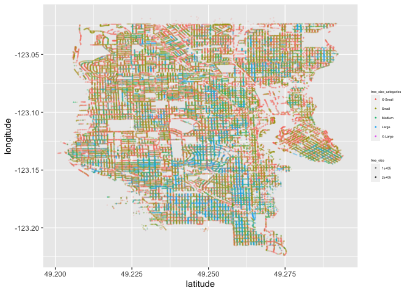
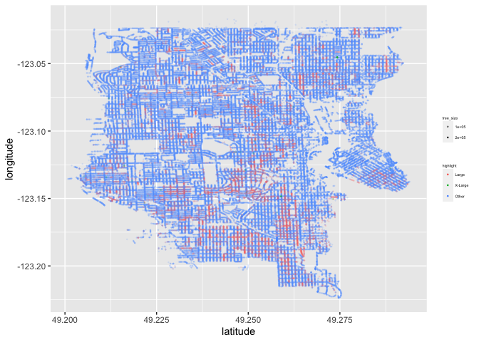

Mini Data Analysis Deliverable 2
================

true

*To complete this milestone, you can edit [this `.rmd`
file](https://raw.githubusercontent.com/UBC-STAT/stat545.stat.ubc.ca/master/content/mini-project/mini-project-2.Rmd)
directly. Fill in the sections that are commented out with
`<!--- start your work here--->`. When you are done, make sure to knit
to an `.md` file by changing the output in the YAML header to
`github_document`, before submitting a tagged release on canvas.*

# Welcome to your second (and last) milestone in your mini data analysis project!

In Milestone 1, you explored your data, came up with research questions,
and obtained some results by making summary tables and graphs. This
time, we will first explore more in depth the concept of *tidy data.*
Then, you’ll be sharpening some of the results you obtained from your
previous milestone by:

-   Manipulating special data types in R: factors and/or dates and
    times.
-   Fitting a model object to your data, and extract a result.
-   Reading and writing data as separate files.

**NOTE**: The main purpose of the mini data analysis is to integrate
what you learn in class in an analysis. Although each milestone provides
a framework for you to conduct your analysis, it’s possible that you
might find the instructions too rigid for your data set. If this is the
case, you may deviate from the instructions – just make sure you’re
demonstrating a wide range of tools and techniques taught in this class.

# Instructions

**To complete this milestone**, edit [this very `.Rmd`
file](https://raw.githubusercontent.com/UBC-STAT/stat545.stat.ubc.ca/master/content/mini-project/mini-project-2.Rmd)
directly. Fill in the sections that are tagged with
`<!--- start your work here--->`.

**To submit this milestone**, make sure to knit this `.Rmd` file to an
`.md` file by changing the YAML output settings from
`output: html_document` to `output: github_document`. Commit and push
all of your work to your mini-analysis GitHub repository, and tag a
release on GitHub. Then, submit a link to your tagged release on canvas.

**Points**: This milestone is worth 55 points (compared to the 45 points
of the Milestone 1): 45 for your analysis, and 10 for your entire
mini-analysis GitHub repository. Details follow.

**Research Questions**: In Milestone 1, you chose two research questions
to focus on. Wherever realistic, your work in this milestone should
relate to these research questions whenever we ask for justification
behind your work. In the case that some tasks in this milestone don’t
align well with one of your research questions, feel free to discuss
your results in the context of a different research question.

# Learning Objectives

By the end of this milestone, you should:

-   Understand what *tidy* data is, and how to create it using `tidyr`.
-   Generate a reproducible and clear report using R Markdown.
-   Manipulating special data types in R: factors and/or dates and
    times.
-   Fitting a model object to your data, and extract a result.
-   Reading and writing data as separate files.

# Setup

Begin by loading your data and the tidyverse package below:

``` r
library(datateachr) # <- might contain the data you picked!
library(tidyverse)
library(dplyr)
library(lubridate)
library(forcats)
library(broom)
```

# Task 1: Tidy your data (15 points)

In this task, we will do several exercises to reshape our data. The goal
here is to understand how to do this reshaping with the `tidyr` package.

A reminder of the definition of *tidy* data:

-   Each row is an **observation**
-   Each column is a **variable**
-   Each cell is a **value**

*Tidy’ing* data is sometimes necessary because it can simplify
computation. Other times it can be nice to organize data so that it can
be easier to understand when read manually.

### 2.1 (2.5 points)

Based on the definition above, can you identify if your data is tidy or
untidy? Go through all your columns, or if you have \>8 variables, just
pick 8, and explain whether the data is untidy or tidy.

<!--------------------------- Start your work below --------------------------->

**The vancouver_trees dataset is a tidy dataset. Each variable forms a
column, and each observation (one tree) forms its own row. Additionally
each cell contains a single measurement.**

<!----------------------------------------------------------------------------->

### 2.2 (5 points)

Now, if your data is tidy, untidy it! Then, tidy it back to it’s
original state.

If your data is untidy, then tidy it! Then, untidy it back to it’s
original state.

Be sure to explain your reasoning for this task. Show us the “before”
and “after”.

<!--------------------------- Start your work below --------------------------->

**The following code block shows how the dataset appears before it is
untidy-ed:**

``` r
vancouver_trees
```

    ## # A tibble: 146,611 × 20
    ##    tree_id civic_number std_st…¹ genus…² speci…³ culti…⁴ commo…⁵ assig…⁶ root_…⁷
    ##      <dbl>        <dbl> <chr>    <chr>   <chr>   <chr>   <chr>   <chr>   <chr>  
    ##  1  149556          494 W 58TH … ULMUS   AMERIC… BRANDON BRANDO… N       N      
    ##  2  149563          450 W 58TH … ZELKOVA SERRATA <NA>    JAPANE… N       N      
    ##  3  149579         4994 WINDSOR… STYRAX  JAPONI… <NA>    JAPANE… N       N      
    ##  4  149590          858 E 39TH … FRAXIN… AMERIC… AUTUMN… AUTUMN… Y       N      
    ##  5  149604         5032 WINDSOR… ACER    CAMPES… <NA>    HEDGE … N       N      
    ##  6  149616          585 W 61ST … PYRUS   CALLER… CHANTI… CHANTI… N       N      
    ##  7  149617         4909 SHERBRO… ACER    PLATAN… COLUMN… COLUMN… N       N      
    ##  8  149618         4925 SHERBRO… ACER    PLATAN… COLUMN… COLUMN… N       N      
    ##  9  149619         4969 SHERBRO… ACER    PLATAN… COLUMN… COLUMN… N       N      
    ## 10  149625          720 E 39TH … FRAXIN… AMERIC… AUTUMN… AUTUMN… N       N      
    ## # … with 146,601 more rows, 11 more variables: plant_area <chr>,
    ## #   on_street_block <dbl>, on_street <chr>, neighbourhood_name <chr>,
    ## #   street_side_name <chr>, height_range_id <dbl>, diameter <dbl>, curb <chr>,
    ## #   date_planted <date>, longitude <dbl>, latitude <dbl>, and abbreviated
    ## #   variable names ¹​std_street, ²​genus_name, ³​species_name, ⁴​cultivar_name,
    ## #   ⁵​common_name, ⁶​assigned, ⁷​root_barrier

**The following code block untidy-es this dataset and then displays the
untidy version:**

``` r
untidy_trees <- vancouver_trees %>% 
  mutate(coordinates = paste(latitude, longitude))

head(untidy_trees)
```

    ## # A tibble: 6 × 21
    ##   tree_id civic_number std_str…¹ genus…² speci…³ culti…⁴ commo…⁵ assig…⁶ root_…⁷
    ##     <dbl>        <dbl> <chr>     <chr>   <chr>   <chr>   <chr>   <chr>   <chr>  
    ## 1  149556          494 W 58TH AV ULMUS   AMERIC… BRANDON BRANDO… N       N      
    ## 2  149563          450 W 58TH AV ZELKOVA SERRATA <NA>    JAPANE… N       N      
    ## 3  149579         4994 WINDSOR … STYRAX  JAPONI… <NA>    JAPANE… N       N      
    ## 4  149590          858 E 39TH AV FRAXIN… AMERIC… AUTUMN… AUTUMN… Y       N      
    ## 5  149604         5032 WINDSOR … ACER    CAMPES… <NA>    HEDGE … N       N      
    ## 6  149616          585 W 61ST AV PYRUS   CALLER… CHANTI… CHANTI… N       N      
    ## # … with 12 more variables: plant_area <chr>, on_street_block <dbl>,
    ## #   on_street <chr>, neighbourhood_name <chr>, street_side_name <chr>,
    ## #   height_range_id <dbl>, diameter <dbl>, curb <chr>, date_planted <date>,
    ## #   longitude <dbl>, latitude <dbl>, coordinates <chr>, and abbreviated
    ## #   variable names ¹​std_street, ²​genus_name, ³​species_name, ⁴​cultivar_name,
    ## #   ⁵​common_name, ⁶​assigned, ⁷​root_barrier

``` r
glimpse(untidy_trees)
```

    ## Rows: 146,611
    ## Columns: 21
    ## $ tree_id            <dbl> 149556, 149563, 149579, 149590, 149604, 149616, 149…
    ## $ civic_number       <dbl> 494, 450, 4994, 858, 5032, 585, 4909, 4925, 4969, 7…
    ## $ std_street         <chr> "W 58TH AV", "W 58TH AV", "WINDSOR ST", "E 39TH AV"…
    ## $ genus_name         <chr> "ULMUS", "ZELKOVA", "STYRAX", "FRAXINUS", "ACER", "…
    ## $ species_name       <chr> "AMERICANA", "SERRATA", "JAPONICA", "AMERICANA", "C…
    ## $ cultivar_name      <chr> "BRANDON", NA, NA, "AUTUMN APPLAUSE", NA, "CHANTICL…
    ## $ common_name        <chr> "BRANDON ELM", "JAPANESE ZELKOVA", "JAPANESE SNOWBE…
    ## $ assigned           <chr> "N", "N", "N", "Y", "N", "N", "N", "N", "N", "N", "…
    ## $ root_barrier       <chr> "N", "N", "N", "N", "N", "N", "N", "N", "N", "N", "…
    ## $ plant_area         <chr> "N", "N", "4", "4", "4", "B", "6", "6", "3", "3", "…
    ## $ on_street_block    <dbl> 400, 400, 4900, 800, 5000, 500, 4900, 4900, 4900, 7…
    ## $ on_street          <chr> "W 58TH AV", "W 58TH AV", "WINDSOR ST", "E 39TH AV"…
    ## $ neighbourhood_name <chr> "MARPOLE", "MARPOLE", "KENSINGTON-CEDAR COTTAGE", "…
    ## $ street_side_name   <chr> "EVEN", "EVEN", "EVEN", "EVEN", "EVEN", "ODD", "ODD…
    ## $ height_range_id    <dbl> 2, 4, 3, 4, 2, 2, 3, 3, 2, 2, 2, 5, 3, 2, 2, 2, 2, …
    ## $ diameter           <dbl> 10.00, 10.00, 4.00, 18.00, 9.00, 5.00, 15.00, 14.00…
    ## $ curb               <chr> "N", "N", "Y", "Y", "Y", "Y", "Y", "Y", "Y", "Y", "…
    ## $ date_planted       <date> 1999-01-13, 1996-05-31, 1993-11-22, 1996-04-29, 19…
    ## $ longitude          <dbl> -123.1161, -123.1147, -123.0846, -123.0870, -123.08…
    ## $ latitude           <dbl> 49.21776, 49.21776, 49.23938, 49.23469, 49.23894, 4…
    ## $ coordinates        <chr> "49.217763 -123.116113", "49.217759 -123.114718", "…

**To untidy the dataset above I combined the variables latitude and
longitude into one variable - coordinates. Though having a coordinates
variable may be nice if you wanted to see exactly where a tree is in the
city, the fact that cells in the coordinates column contain more than a
single measurement makes this untidy data, and it would be difficult to
plot or run analysis with.**

**To tidy this dataset back up I just remove the coordinates variable
from the dataset - we’ll just have to work with latitude and longitude
separately!**

``` r
tidy_trees <- select(untidy_trees, -coordinates)
head(tidy_trees)
```

    ## # A tibble: 6 × 20
    ##   tree_id civic_number std_str…¹ genus…² speci…³ culti…⁴ commo…⁵ assig…⁶ root_…⁷
    ##     <dbl>        <dbl> <chr>     <chr>   <chr>   <chr>   <chr>   <chr>   <chr>  
    ## 1  149556          494 W 58TH AV ULMUS   AMERIC… BRANDON BRANDO… N       N      
    ## 2  149563          450 W 58TH AV ZELKOVA SERRATA <NA>    JAPANE… N       N      
    ## 3  149579         4994 WINDSOR … STYRAX  JAPONI… <NA>    JAPANE… N       N      
    ## 4  149590          858 E 39TH AV FRAXIN… AMERIC… AUTUMN… AUTUMN… Y       N      
    ## 5  149604         5032 WINDSOR … ACER    CAMPES… <NA>    HEDGE … N       N      
    ## 6  149616          585 W 61ST AV PYRUS   CALLER… CHANTI… CHANTI… N       N      
    ## # … with 11 more variables: plant_area <chr>, on_street_block <dbl>,
    ## #   on_street <chr>, neighbourhood_name <chr>, street_side_name <chr>,
    ## #   height_range_id <dbl>, diameter <dbl>, curb <chr>, date_planted <date>,
    ## #   longitude <dbl>, latitude <dbl>, and abbreviated variable names
    ## #   ¹​std_street, ²​genus_name, ³​species_name, ⁴​cultivar_name, ⁵​common_name,
    ## #   ⁶​assigned, ⁷​root_barrier

``` r
glimpse(tidy_trees)
```

    ## Rows: 146,611
    ## Columns: 20
    ## $ tree_id            <dbl> 149556, 149563, 149579, 149590, 149604, 149616, 149…
    ## $ civic_number       <dbl> 494, 450, 4994, 858, 5032, 585, 4909, 4925, 4969, 7…
    ## $ std_street         <chr> "W 58TH AV", "W 58TH AV", "WINDSOR ST", "E 39TH AV"…
    ## $ genus_name         <chr> "ULMUS", "ZELKOVA", "STYRAX", "FRAXINUS", "ACER", "…
    ## $ species_name       <chr> "AMERICANA", "SERRATA", "JAPONICA", "AMERICANA", "C…
    ## $ cultivar_name      <chr> "BRANDON", NA, NA, "AUTUMN APPLAUSE", NA, "CHANTICL…
    ## $ common_name        <chr> "BRANDON ELM", "JAPANESE ZELKOVA", "JAPANESE SNOWBE…
    ## $ assigned           <chr> "N", "N", "N", "Y", "N", "N", "N", "N", "N", "N", "…
    ## $ root_barrier       <chr> "N", "N", "N", "N", "N", "N", "N", "N", "N", "N", "…
    ## $ plant_area         <chr> "N", "N", "4", "4", "4", "B", "6", "6", "3", "3", "…
    ## $ on_street_block    <dbl> 400, 400, 4900, 800, 5000, 500, 4900, 4900, 4900, 7…
    ## $ on_street          <chr> "W 58TH AV", "W 58TH AV", "WINDSOR ST", "E 39TH AV"…
    ## $ neighbourhood_name <chr> "MARPOLE", "MARPOLE", "KENSINGTON-CEDAR COTTAGE", "…
    ## $ street_side_name   <chr> "EVEN", "EVEN", "EVEN", "EVEN", "EVEN", "ODD", "ODD…
    ## $ height_range_id    <dbl> 2, 4, 3, 4, 2, 2, 3, 3, 2, 2, 2, 5, 3, 2, 2, 2, 2, …
    ## $ diameter           <dbl> 10.00, 10.00, 4.00, 18.00, 9.00, 5.00, 15.00, 14.00…
    ## $ curb               <chr> "N", "N", "Y", "Y", "Y", "Y", "Y", "Y", "Y", "Y", "…
    ## $ date_planted       <date> 1999-01-13, 1996-05-31, 1993-11-22, 1996-04-29, 19…
    ## $ longitude          <dbl> -123.1161, -123.1147, -123.0846, -123.0870, -123.08…
    ## $ latitude           <dbl> 49.21776, 49.21776, 49.23938, 49.23469, 49.23894, 4…

<!----------------------------------------------------------------------------->

### 2.3 (7.5 points)

Now, you should be more familiar with your data, and also have made
progress in answering your research questions. Based on your interest,
and your analyses, pick 2 of the 4 research questions to continue your
analysis in the next four tasks:

<!-------------------------- Start your work below ---------------------------->

1.  What variables affect size of tree?
2.  Which neighbourhood has the most big trees?

<!----------------------------------------------------------------------------->

Explain your decision for choosing the above two research questions.

<!--------------------------- Start your work below --------------------------->

**Both of these questions were not answered in the last analysis.
Additionally, these are both multi-faceted questions that will require
analyzing several variables in several steps - these means they will
likely be good questions to carry forward in this data analysis and will
be robust enough and allow enough freedom to complete the tasks laid
out. Also I think they’re interesting and I would like to walk around in
places that have big trees once I finish this project. **

<!----------------------------------------------------------------------------->

Now, try to choose a version of your data that you think will be
appropriate to answer these 2 questions. Use between 4 and 8 functions
that we’ve covered so far (i.e. by filtering, cleaning, tidy’ing,
dropping irrelevant columns, etc.).

<!--------------------------- Start your work below --------------------------->

**In the following code block I have dropped columns that are irrelevant
to answering these questions:**

``` r
tidy_trees <- select(tidy_trees, -c(civic_number, common_name, assigned, std_street))
glimpse(tidy_trees)
```

    ## Rows: 146,611
    ## Columns: 16
    ## $ tree_id            <dbl> 149556, 149563, 149579, 149590, 149604, 149616, 149…
    ## $ genus_name         <chr> "ULMUS", "ZELKOVA", "STYRAX", "FRAXINUS", "ACER", "…
    ## $ species_name       <chr> "AMERICANA", "SERRATA", "JAPONICA", "AMERICANA", "C…
    ## $ cultivar_name      <chr> "BRANDON", NA, NA, "AUTUMN APPLAUSE", NA, "CHANTICL…
    ## $ root_barrier       <chr> "N", "N", "N", "N", "N", "N", "N", "N", "N", "N", "…
    ## $ plant_area         <chr> "N", "N", "4", "4", "4", "B", "6", "6", "3", "3", "…
    ## $ on_street_block    <dbl> 400, 400, 4900, 800, 5000, 500, 4900, 4900, 4900, 7…
    ## $ on_street          <chr> "W 58TH AV", "W 58TH AV", "WINDSOR ST", "E 39TH AV"…
    ## $ neighbourhood_name <chr> "MARPOLE", "MARPOLE", "KENSINGTON-CEDAR COTTAGE", "…
    ## $ street_side_name   <chr> "EVEN", "EVEN", "EVEN", "EVEN", "EVEN", "ODD", "ODD…
    ## $ height_range_id    <dbl> 2, 4, 3, 4, 2, 2, 3, 3, 2, 2, 2, 5, 3, 2, 2, 2, 2, …
    ## $ diameter           <dbl> 10.00, 10.00, 4.00, 18.00, 9.00, 5.00, 15.00, 14.00…
    ## $ curb               <chr> "N", "N", "Y", "Y", "Y", "Y", "Y", "Y", "Y", "Y", "…
    ## $ date_planted       <date> 1999-01-13, 1996-05-31, 1993-11-22, 1996-04-29, 19…
    ## $ longitude          <dbl> -123.1161, -123.1147, -123.0846, -123.0870, -123.08…
    ## $ latitude           <dbl> 49.21776, 49.21776, 49.23938, 49.23469, 49.23894, 4…

**In the following codeblock I have mutated the dataset to include one
variable representative of tree size (so we can use this instead of both
diameter and height_range_id), I have grouped the dataset by
neighborhood name and arranged by tree size, and finally I removed any
datapoints with a tree size of 0, as this is not helpful for the
analysis of either question.**

``` r
tidy_trees <- tidy_trees %>%
  mutate(tidy_trees, tree_size = ((2 * 3.14 *(diameter/2)*height_range_id) + (2*3.14)*((diameter/2)**2))) %>% 
  group_by(neighbourhood_name) %>%
  arrange(tree_size) %>%
  filter(tree_size > 0)
  
tidy_trees  
```

    ## # A tibble: 146,519 × 17
    ## # Groups:   neighbourhood_name [22]
    ##    tree_id genus_name species_…¹ culti…² root_…³ plant…⁴ on_st…⁵ on_st…⁶ neigh…⁷
    ##      <dbl> <chr>      <chr>      <chr>   <chr>   <chr>     <dbl> <chr>   <chr>  
    ##  1   92220 MALUS      FLORIBUNDA <NA>    N       10         5900 MACDON… KERRIS…
    ##  2  257371 STYRAX     JAPONICA   <NA>    N       7          4000 ASH ST  SOUTH …
    ##  3  198177 PYRUS      CALLERYANA CHANTI… N       N          2400 E 48TH… VICTOR…
    ##  4   50713 PRUNUS     CERASIFERA ATROPU… N       12          100 E 60TH… SUNSET 
    ##  5  189630 ACER       CAMPESTRE  QUEEN … N       10         2200 E 51ST… VICTOR…
    ##  6   49630 PRUNUS     CERASIFERA ATROPU… N       9           200 E 58TH… SUNSET 
    ##  7   31025 LABURNUM   WATERERI … <NA>    N       N          4600 CROWN … DUNBAR…
    ##  8  136795 PRUNUS     X YEDOENS… AKEBONO N       8          1400 E 20TH… KENSIN…
    ##  9  107016 MALUS      FLORIBUNDA <NA>    N       10         4800 QUEBEC… RILEY …
    ## 10  212285 ZELKOVA    SERRATA    VILLAG… Y       8          2900 E 27TH… RENFRE…
    ## # … with 146,509 more rows, 8 more variables: street_side_name <chr>,
    ## #   height_range_id <dbl>, diameter <dbl>, curb <chr>, date_planted <date>,
    ## #   longitude <dbl>, latitude <dbl>, tree_size <dbl>, and abbreviated variable
    ## #   names ¹​species_name, ²​cultivar_name, ³​root_barrier, ⁴​plant_area,
    ## #   ⁵​on_street_block, ⁶​on_street, ⁷​neighbourhood_name

<!----------------------------------------------------------------------------->

# Task 2: Special Data Types (10)

For this exercise, you’ll be choosing two of the three tasks below –
both tasks that you choose are worth 5 points each.

But first, tasks 1 and 2 below ask you to modify a plot you made in a
previous milestone. The plot you choose should involve plotting across
at least three groups (whether by facetting, or using an aesthetic like
colour). Place this plot below (you’re allowed to modify the plot if
you’d like). If you don’t have such a plot, you’ll need to make one.
Place the code for your plot below.

<!-------------------------- Start your work below ---------------------------->

**The following plot is colour-coded to show the tree size category each
tree falls into, and plots the tree position by latitude and
longitude:**

``` r
tidy_trees %>%
  mutate(tree_size_categories = factor(cut(tree_size, breaks = c(-Inf,200,800,1500,8000,Inf), labels = c("X-Small", "Small", "Medium", "Large", "X-Large")))) %>%
  ggplot(vancouver_trees, mapping = aes(latitude, longitude)) +
  geom_point(size = 0.2, mapping = aes(colour = tree_size_categories, alpha = tree_size)) +
  theme(legend.key.size = unit(0.4, 'cm'),
        legend.key.height = unit(0.4, 'cm'), 
        legend.key.width = unit(0.4, 'cm'), 
        legend.title = element_text(size=4), 
        legend.text = element_text(size=4)) 
```

    ## Warning: Removed 22700 rows containing missing values (geom_point).

<!-- -->

<!----------------------------------------------------------------------------->

Now, choose two of the following tasks.

1.  Produce a new plot that reorders a factor in your original plot,
    using the `forcats` package (3 points). Then, in a sentence or two,
    briefly explain why you chose this ordering (1 point here for
    demonstrating understanding of the reordering, and 1 point for
    demonstrating some justification for the reordering, which could be
    subtle or speculative.)

2.  Produce a new plot that groups some factor levels together into an
    “other” category (or something similar), using the `forcats` package
    (3 points). Then, in a sentence or two, briefly explain why you
    chose this grouping (1 point here for demonstrating understanding of
    the grouping, and 1 point for demonstrating some justification for
    the grouping, which could be subtle or speculative.)

3.  If your data has some sort of time-based column like a date (but
    something more granular than just a year):

    1.  Make a new column that uses a function from the `lubridate` or
        `tsibble` package to modify your original time-based column. (3
        points)

        -   Note that you might first have to *make* a time-based column
            using a function like `ymd()`, but this doesn’t count.
        -   Examples of something you might do here: extract the day of
            the year from a date, or extract the weekday, or let 24
            hours elapse on your dates.

    2.  Then, in a sentence or two, explain how your new column might be
        useful in exploring a research question. (1 point for
        demonstrating understanding of the function you used, and 1
        point for your justification, which could be subtle or
        speculative).

        -   For example, you could say something like “Investigating the
            day of the week might be insightful because penguins don’t
            work on weekends, and so may respond differently”.

<!-------------------------- Start your work below ---------------------------->

**Task Number**: 2

``` r
tidy_trees %>%
  mutate(tree_size_categories = factor(cut(tree_size, breaks = c(-Inf,200,800,1500,8000,Inf), labels = c("X-Small", "Small", "Medium", "Large", "X-Large")))) %>%
  mutate(highlight = fct_other(tree_size_categories, keep = c("Large", "X-Large"))) %>%
  ggplot(vancouver_trees, mapping = aes(latitude, longitude)) +
  geom_point(size = 0.2, mapping = aes(colour = highlight, alpha = tree_size)) +
  theme(legend.key.size = unit(0.4, 'cm'),
        legend.key.height = unit(0.4, 'cm'), 
        legend.key.width = unit(0.4, 'cm'), 
        legend.title = element_text(size=4), 
        legend.text = element_text(size=4)) 
```

    ## Warning: Removed 22700 rows containing missing values (geom_point).

<!-- -->

**In the above plot I have grouped all trees that fall into the X-small,
small and medium categories together. I chose this grouping because I am
most interested in the large and x-large trees, and the way they are
distributed in different neighbourhoods. By grouping the smaller trees
together so that they are all represented by the same colour, it bring
the noise level of the plot down and allows us to see the large and
x-large trees more clearly.**

<!----------------------------------------------------------------------------->
<!-------------------------- Start your work below ---------------------------->

**Task Number**: 3

**In the following codeblock I used the lubridate package to convert the
date_planted column to a date object, and then use that to calculate the
age of each tree in days:**

``` r
tidy_trees$date_planted <- ymd(tidy_trees$date_planted)
today_date = today()
tidy_trees <- mutate(tidy_trees, tree_age = today_date - date_planted)
glimpse(tidy_trees)
```

    ## Rows: 146,519
    ## Columns: 18
    ## Groups: neighbourhood_name [22]
    ## $ tree_id            <dbl> 92220, 257371, 198177, 50713, 189630, 49630, 31025,…
    ## $ genus_name         <chr> "MALUS", "STYRAX", "PYRUS", "PRUNUS", "ACER", "PRUN…
    ## $ species_name       <chr> "FLORIBUNDA", "JAPONICA", "CALLERYANA", "CERASIFERA…
    ## $ cultivar_name      <chr> NA, NA, "CHANTICLEER", "ATROPURPUREUM", "QUEEN ELIZ…
    ## $ root_barrier       <chr> "N", "N", "N", "N", "N", "N", "N", "N", "N", "Y", "…
    ## $ plant_area         <chr> "10", "7", "N", "12", "10", "9", "N", "8", "10", "8…
    ## $ on_street_block    <dbl> 5900, 4000, 2400, 100, 2200, 200, 4600, 1400, 4800,…
    ## $ on_street          <chr> "MACDONALD ST", "ASH ST", "E 48TH AV", "E 60TH AV",…
    ## $ neighbourhood_name <chr> "KERRISDALE", "SOUTH CAMBIE", "VICTORIA-FRASERVIEW"…
    ## $ street_side_name   <chr> "EVEN", "EVEN", "ODD", "ODD", "ODD", "ODD", "EVEN",…
    ## $ height_range_id    <dbl> 1, 0, 2, 2, 2, 2, 1, 1, 1, 1, 3, 2, 2, 2, 2, 2, 2, …
    ## $ diameter           <dbl> 0.25, 1.00, 0.25, 0.25, 0.25, 0.25, 0.50, 0.50, 0.5…
    ## $ curb               <chr> "Y", "Y", "Y", "Y", "Y", "Y", "Y", "Y", "Y", "Y", "…
    ## $ date_planted       <date> NA, NA, 2003-02-04, NA, 2001-11-19, NA, NA, 1993-0…
    ## $ longitude          <dbl> -123.1673, NA, -123.0572, -123.1030, -123.0600, -12…
    ## $ latitude           <dbl> 49.23204, NA, 49.22583, 49.21593, 49.22314, 49.2176…
    ## $ tree_size          <dbl> 0.883125, 1.570000, 1.668125, 1.668125, 1.668125, 1…
    ## $ tree_age           <drtn> NA days, NA days, 7204 days, NA days, 7646 days, N…

``` r
head(tidy_trees)
```

    ## # A tibble: 6 × 18
    ## # Groups:   neighbourhood_name [4]
    ##   tree_id genus_name species_n…¹ culti…² root_…³ plant…⁴ on_st…⁵ on_st…⁶ neigh…⁷
    ##     <dbl> <chr>      <chr>       <chr>   <chr>   <chr>     <dbl> <chr>   <chr>  
    ## 1   92220 MALUS      FLORIBUNDA  <NA>    N       10         5900 MACDON… KERRIS…
    ## 2  257371 STYRAX     JAPONICA    <NA>    N       7          4000 ASH ST  SOUTH …
    ## 3  198177 PYRUS      CALLERYANA  CHANTI… N       N          2400 E 48TH… VICTOR…
    ## 4   50713 PRUNUS     CERASIFERA  ATROPU… N       12          100 E 60TH… SUNSET 
    ## 5  189630 ACER       CAMPESTRE   QUEEN … N       10         2200 E 51ST… VICTOR…
    ## 6   49630 PRUNUS     CERASIFERA  ATROPU… N       9           200 E 58TH… SUNSET 
    ## # … with 9 more variables: street_side_name <chr>, height_range_id <dbl>,
    ## #   diameter <dbl>, curb <chr>, date_planted <date>, longitude <dbl>,
    ## #   latitude <dbl>, tree_size <dbl>, tree_age <drtn>, and abbreviated variable
    ## #   names ¹​species_name, ²​cultivar_name, ³​root_barrier, ⁴​plant_area,
    ## #   ⁵​on_street_block, ⁶​on_street, ⁷​neighbourhood_name

**This new tree_age category is very useful for answering the two
research questions, as the size of a tree is directly related to its
age! Obviously older trees are going to be bigger, so in order to assess
the effect of other variables on tree size we should try to control for
tree age - which we can only do if we have a column for this variable.**

<!----------------------------------------------------------------------------->

# Task 3: Modelling

## 2.0 (no points)

Pick a research question, and pick a variable of interest (we’ll call it
“Y”) that’s relevant to the research question. Indicate these.

<!-------------------------- Start your work below ---------------------------->

**Research Question**: Is there a difference in average tree size
between neighbourhoods?

**Variable of interest**: tree_size

<!----------------------------------------------------------------------------->

## 2.1 (5 points)

Fit a model or run a hypothesis test that provides insight on this
variable with respect to the research question. Store the model object
as a variable, and print its output to screen. We’ll omit having to
justify your choice, because we don’t expect you to know about model
specifics in STAT 545.

-   **Note**: It’s OK if you don’t know how these models/tests work.
    Here are some examples of things you can do here, but the sky’s the
    limit.

    -   You could fit a model that makes predictions on Y using another
        variable, by using the `lm()` function.
    -   You could test whether the mean of Y equals 0 using `t.test()`,
        or maybe the mean across two groups are different using
        `t.test()`, or maybe the mean across multiple groups are
        different using `anova()` (you may have to pivot your data for
        the latter two).
    -   You could use `lm()` to test for significance of regression.

<!-------------------------- Start your work below ---------------------------->

**In the following code block I run an anova to estimate if
neighbourhood group has an effect on average tree size:**

``` r
tree_anova <- aov(tree_size ~ neighbourhood_name, data = tidy_trees)
summary(tree_anova)
```

    ##                        Df    Sum Sq   Mean Sq F value Pr(>F)    
    ## neighbourhood_name     21 2.466e+09 117419443   80.53 <2e-16 ***
    ## Residuals          146497 2.136e+11   1458039                   
    ## ---
    ## Signif. codes:  0 '***' 0.001 '**' 0.01 '*' 0.05 '.' 0.1 ' ' 1

``` r
print(tree_anova)
```

    ## Call:
    ##    aov(formula = tree_size ~ neighbourhood_name, data = tidy_trees)
    ## 
    ## Terms:
    ##                 neighbourhood_name    Residuals
    ## Sum of Squares          2465808295 213598353398
    ## Deg. of Freedom                 21       146497
    ## 
    ## Residual standard error: 1207.493
    ## Estimated effects may be unbalanced

<!----------------------------------------------------------------------------->

## 2.2 (5 points)

Produce something relevant from your fitted model: either predictions on
Y, or a single value like a regression coefficient or a p-value.

-   Be sure to indicate in writing what you chose to produce.
-   Your code should either output a tibble (in which case you should
    indicate the column that contains the thing you’re looking for), or
    the thing you’re looking for itself.
-   Obtain your results using the `broom` package if possible. If your
    model is not compatible with the broom function you’re needing, then
    you can obtain your results by some other means, but first indicate
    which broom function is not compatible.

<!-------------------------- Start your work below ---------------------------->

**The following codeblock uses the broom package function ‘tidy’ to
produce a statistical summary of each component of the tree_anova
model:**

``` r
tidy(tree_anova)
```

    ## # A tibble: 2 × 6
    ##   term                   df         sumsq     meansq statistic p.value
    ##   <chr>               <dbl>         <dbl>      <dbl>     <dbl>   <dbl>
    ## 1 neighbourhood_name     21   2465808295. 117419443.      80.5       0
    ## 2 Residuals          146497 213598353398.   1458039.      NA        NA

**The last column (p.value) of the tibble produced by the above code
block contains the p-value for this model.**

<!----------------------------------------------------------------------------->

# Task 4: Reading and writing data

Get set up for this exercise by making a folder called `output` in the
top level of your project folder / repository. You’ll be saving things
there.

## 3.1 (5 points)

Take a summary table that you made from Milestone 1 (Task 4.2), and
write it as a csv file in your `output` folder. Use the `here::here()`
function.

-   **Robustness criteria**: You should be able to move your Mini
    Project repository / project folder to some other location on your
    computer, or move this very Rmd file to another location within your
    project repository / folder, and your code should still work.
-   **Reproducibility criteria**: You should be able to delete the csv
    file, and remake it simply by knitting this Rmd file.

<!-------------------------- Start your work below ---------------------------->

**For this task I will use the vancouver_trees_with_tree_size summary
table produced in Milestone 1, which is shown in the codeblock below:**

``` r
vancouver_trees_with_tree_size <- vancouver_trees %>%
  mutate(tree_size = ((2 * 3.14 *(diameter/2)*height_range_id) + (2*3.14)*((diameter/2)**2))) %>%
  group_by(curb) %>%
  summarise(tree_size_mean = mean(tree_size, na.rm =TRUE), tree_size_range = range(tree_size, na.rm = TRUE), tree_size_median = median(tree_size, na.rm = TRUE), tree_size_max = max(tree_size))
```

    ## `summarise()` has grouped output by 'curb'. You can override using the
    ## `.groups` argument.

``` r
vancouver_trees_with_tree_size
```

    ## # A tibble: 4 × 5
    ## # Groups:   curb [2]
    ##   curb  tree_size_mean tree_size_range tree_size_median tree_size_max
    ##   <chr>          <dbl>           <dbl>            <dbl>         <dbl>
    ## 1 N               573.              0              251.        42718.
    ## 2 N               573.          42718.             251.        42718.
    ## 3 Y               459.              0              184.       299815.
    ## 4 Y               459.         299815.             184.       299815.

**In the following codeblock I write this summary table as a csv into
the output file:**

``` r
write_csv(vancouver_trees_with_tree_size, here::here("output", "vancouver_trees_with_tree_size_summary.csv"))
dir(here::here("output"))
```

    ## [1] "vancouver_trees_with_tree_size_summary.csv"
    ## [2] "vancouver_trees_with_tree_size_summary.rds"

<!----------------------------------------------------------------------------->

## 3.2 (5 points)

Write your model object from Task 3 to an R binary file (an RDS), and
load it again. Be sure to save the binary file in your `output` folder.
Use the functions `saveRDS()` and `readRDS()`.

-   The same robustness and reproducibility criteria as in 3.1 apply
    here.

<!-------------------------- Start your work below ---------------------------->

**In the following codeblock I save the vancouver_trees_with_tree_size
summary table as an rds file into my output folder, and then load it
again:**

``` r
saveRDS(vancouver_trees_with_tree_size, here::here("output", "vancouver_trees_with_tree_size_summary.rds"))
vancouver_trees_with_tree_size <- readRDS(here::here("output", "vancouver_trees_with_tree_size_summary.rds"))
vancouver_trees_with_tree_size
```

    ## # A tibble: 4 × 5
    ## # Groups:   curb [2]
    ##   curb  tree_size_mean tree_size_range tree_size_median tree_size_max
    ##   <chr>          <dbl>           <dbl>            <dbl>         <dbl>
    ## 1 N               573.              0              251.        42718.
    ## 2 N               573.          42718.             251.        42718.
    ## 3 Y               459.              0              184.       299815.
    ## 4 Y               459.         299815.             184.       299815.

<!----------------------------------------------------------------------------->

# Tidy Repository

Now that this is your last milestone, your entire project repository
should be organized. Here are the criteria we’re looking for.

## Main README (3 points)

There should be a file named `README.md` at the top level of your
repository. Its contents should automatically appear when you visit the
repository on GitHub.

Minimum contents of the README file:

-   In a sentence or two, explains what this repository is, so that
    future-you or someone else stumbling on your repository can be
    oriented to the repository.
-   In a sentence or two (or more??), briefly explains how to engage
    with the repository. You can assume the person reading knows the
    material from STAT 545A. Basically, if a visitor to your repository
    wants to explore your project, what should they know?

Once you get in the habit of making README files, and seeing more README
files in other projects, you’ll wonder how you ever got by without them!
They are tremendously helpful.

## File and Folder structure (3 points)

You should have at least four folders in the top level of your
repository: one for each milestone, and one output folder. If there are
any other folders, these are explained in the main README.

Each milestone document is contained in its respective folder, and
nowhere else.

Every level-1 folder (that is, the ones stored in the top level, like
“Milestone1” and “output”) has a `README` file, explaining in a sentence
or two what is in the folder, in plain language (it’s enough to say
something like “This folder contains the source for Milestone 1”).

## Output (2 points)

All output is recent and relevant:

-   All Rmd files have been `knit`ted to their output, and all data
    files saved from Task 4 above appear in the `output` folder.
-   All of these output files are up-to-date – that is, they haven’t
    fallen behind after the source (Rmd) files have been updated.
-   There should be no relic output files. For example, if you were
    knitting an Rmd to html, but then changed the output to be only a
    markdown file, then the html file is a relic and should be deleted.

Our recommendation: delete all output files, and re-knit each
milestone’s Rmd file, so that everything is up to date and relevant.

PS: there’s a way where you can run all project code using a single
command, instead of clicking “knit” three times. More on this in STAT
545B!

## Error-free code (1 point)

This Milestone 1 document knits error-free, and the Milestone 2 document
knits error-free.

## Tagged release (1 point)

You’ve tagged a release for Milestone 1, and you’ve tagged a release for
Milestone 2.

### Attribution

Thanks to Victor Yuan for mostly putting this together.
